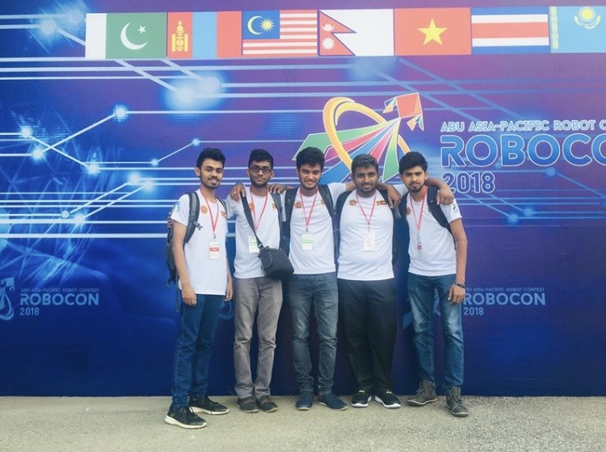

# ABU ROBOCON

The ABU Asia-Pacific Robot Contest (ABU Robocon) is an Asian Oceanian College robot competition, founded in 2002 by Asia-Pacific Broadcasting Union.And we have represented Srilanka since 2005 for 10 times for the biggest robotic competition in Asia Pacific region(local organizer ITN cooperation)

#### Team members :

